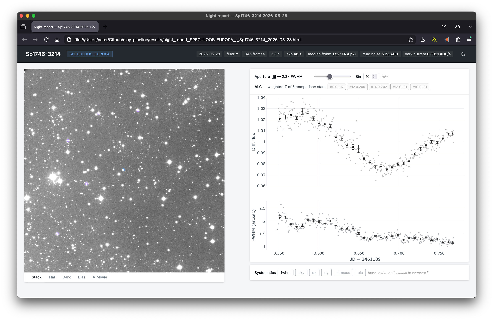

# SPECULOOS-South Photometry Pipeline

Reduce a night of FITS observations into a differential light curve, then turn
that into a self-contained interactive HTML report. Two scripts do the work:
`pipeline.py` (the reduction) and `night_report.py` (the report).



## Quick start

```bash
uv sync                                  # install deps (needs Python 3.11.8)

uv run pipeline.py \
  --image_path /path/to/night/fits \
  --target "Sp1746-3214" \
  --query-string "Gaia DR3 4055579464064558592" \
  --output-dir results/ \
  --report                               # also build the HTML report
```

Point `--image_path` at a directory holding all of the night's frames: lights,
darks, flats, and biases. The right calibration frames are matched to the target
automatically by exposure time and filter, so you don't sort them yourself. Add
`--report` to get the interactive report next to the data, or drop it to run the
reduction alone. `ffmpeg` needs to be on your `PATH` for the report's movie.

## pipeline.py

What it does, per run:

1. Indexes the FITS files by observing night (noon-to-noon, so a run past
   midnight stays on one night), frame type, and target.
2. Builds master bias, dark, and flat frames; estimates read noise and dark
   current.
3. Takes the middle light frame as a reference, detects its stars, solves a WCS
   against Gaia (2MASS for infrared filters), and locates the target via MAST.
4. Processes every light frame in parallel: calibrate, align to the reference,
   refine centroids with the Ballet CNN, then aperture photometry over 40 radii
   (0.5 to 5x FWHM), co-adding a stack as it goes.
5. Runs differential photometry and picks the best aperture from the comparison
   stars' noise.

It saves the two `.npz` bundles below plus two diagnostic PDFs: the light curve,
and a systematics panel (FWHM, sky, centroid drift, airmass).

### Options

| Flag | Default | Description |
|---|---|---|
| `--image_path` | required | Directory of FITS files for the night. |
| `--target` | required | `OBJECT` header value of the science target. |
| `--query-string` | `--target` | Name resolved via MAST |
| `--fix-bad-pixels` | off | Mask hot/dead pixels from the darks and interpolate over them before photometry. |
| `--output-dir` | `.` | Where to write outputs; created if missing. |
| `--report` | off | Build the HTML report (and its assets folder) after reducing. |

### Output

Files are named `<telescope>_<filter>_<target>_<date>`, read from the headers.

- `photometry_data_*.npz` — per-frame fluxes, backgrounds, centroids, metadata.
- `night_report_*.npz` — all of that plus the co-added stack, master frames,
  differential light curves, and movie thumbnails. This is what the report reads.

## night_report.py

Reads a `night_report_*.npz` and writes an HTML page (Plotly and D3 from a CDN)
you can open in any browser, with no server. The movie and stack images go in a
sibling `<report>_assets/` folder that the page references, so keep the two
together when you move or share a report. It gives you:

- a stack viewer (ZScale) with aperture circles and tabs for the flat/dark/bias;
- a night movie whose playhead follows your cursor along the light curve;
- the differential light curve, with aperture and binning controls;
- a systematics panel: FWHM, sky, drift, airmass, ALC, or any single star;
- a light/dark theme toggle.

```bash
uv run night_report.py results/night_report_*.npz \
  [-o report.html] \
  [--fps 15] \
  [--crf 28] \      # movie quality: higher number = smaller file
  [--keyint 1]      # 1 = sharpest scrubbing; larger = smaller file
```

The movie is the largest asset. By default each frame is JPEG-like compressed at
`--crf 28`, which keeps scrubbing sharp; raise `--crf` to shrink it. Setting
`--keyint` above 1 also compresses across frames, which helps on real sky where
consecutive frames barely change. The pipeline's `--report` uses these defaults,
so run `night_report.py` yourself when you want to change them.
